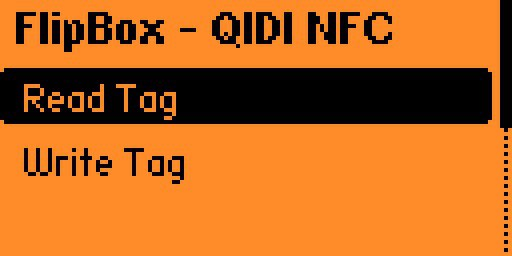
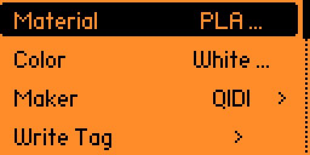
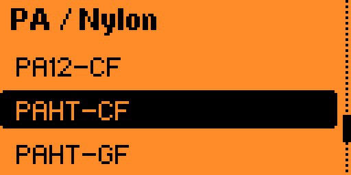
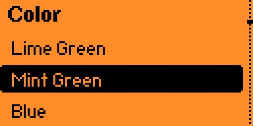

# FlipBox

Flipper Zero app for reading and writing NFC tags used by the [QIDI Box](https://wiki.qidi3d.com/en/QIDIBOX/RFID) filament management system.

## Screenshots

| Menu | Read result | Write config |
|------|-------------|--------------|
|  |  |  |

| Material picker | Color picker | Write success |
|-----------------|--------------|---------------|
|  |  |  |

## What it does

- **Read** — hold the Flipper near a QIDI Box spool tag and see material, color, and manufacturer
- **Write** — pick material / color / maker, then write your own tag

Works with any MIFARE Classic 1K spool tag (FM11RF08S or compatible).

## Compatibility

| Firmware | Status |
|---|---|
| Official Flipper firmware | ✅ |
| Momentum | ✅ |
| Unleashed | ✅ |
| RogueMaster | ✅ |

## Install

Download `flipbox.fap` from [Releases](https://github.com/rmrfus/flipbox/releases) and copy it to `SD:/apps/NFC/` on the Flipper's SD card.

Two ways to copy:

- **qFlipper** — connect Flipper via USB, open [qFlipper](https://flipperzero.one/update), go to SD card browser → `apps/NFC/`, drag the file in
- **USB mass storage** — on the Flipper: `Settings → USB → Mass Storage`, then mount as a flash drive and copy manually

The app will appear in `Apps → NFC → FlipBox`.

## Build from source

Requires [ufbt](https://github.com/flipperdevices/flipperzero-ufbt) and [direnv](https://direnv.net/).

```zsh
git clone https://github.com/rmrfus/flipbox
cd flipbox
direnv allow

# just build → dist/flipbox.fap
direnv exec . ufbt

# or build + deploy + launch over USB serial
direnv exec . ufbt launch
```

`ufbt launch` copies the app to `SD:/apps/NFC/` over USB serial and starts it immediately. The Flipper must be connected, unlocked, and on the main screen.

## Tag format

Chip: FM11RF08S (MIFARE Classic 1K), 13.56 MHz, ISO 14443-A.

Data is in **Sector 1, Block 0** (absolute block 4):

| Byte | Field | Notes |
|---|---|---|
| `[0]` | Material code | 1–50, see table below |
| `[1]` | Color code | 1–24 |
| `[2]` | Manufacturer code | 1 = QIDI, 2 = Generic |
| `[3–15]` | — | Unused, written as `0x00` |

Auth keys tried in order:
1. `D3:F7:D3:F7:D3:F7` (QIDI primary)
2. `FF:FF:FF:FF:FF:FF` (factory default)

> **Note on manufacturer byte:** the current QIDI Box firmware ignores `byte[2]` entirely and hardcodes vendor = 1 internally. The field is written for future firmware compatibility.

### Materials (35 types)

| Group | Materials |
|---|---|
| PLA | PLA, PLA+, PLA Matte, PLA Silk, PLA CF, PLA Wood, PLA-GF, PLA Metal |
| ABS | ABS, ABS+, ABS CF, ABS GF |
| ASA | ASA, ASA CF |
| PA / Nylon | PA, PA-CF, PA-GF, PA6-CF, PA12-CF, PAHT-CF |
| PET / PETG | PETG, PETG-CF, PETG Metal, PETG Silk, PETG+, PET-CF, PCTG |
| Support | PVA, HIPS |
| TPU | TPU, TPU-HF |
| Other | PC, BVOH, PP |

### Colors (24)

White, Black, Red, Blue, Green, Yellow, Orange, Purple, Pink, Grey, Brown, Beige,
Gold, Silver, Cyan, Transparent, Skin, Sky Blue, Army Green, Dark Blue, Dark Red,
Dark Green, Ocean Blue, Multicolor.

## References

- [QIDI Box RFID spec](https://wiki.qidi3d.com/en/QIDIBOX/RFID)
- [QIDI Box firmware source (community reverse-engineered)](https://github.com/qidi-community/Plus4-Wiki/blob/main/content/qidibox-on-orcaslicer/original_source/box_rfid.py)
- [alexk42/qidi-filament-nfc-flipper](https://github.com/alexk42/qidi-filament-nfc-flipper) — original Flipper implementation this was inspired by
